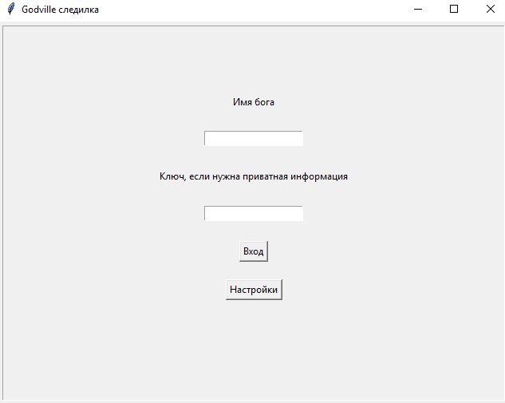
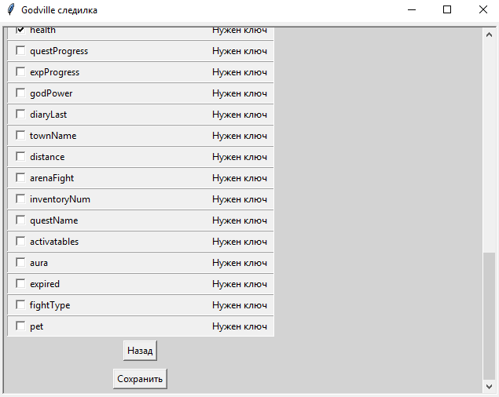
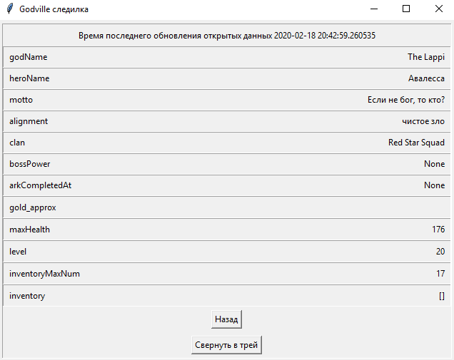
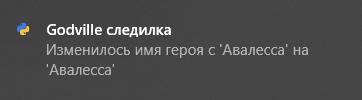
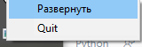

# Godville Monitor
Следилка за героем godville. Позволяет смотреть информацию о герое и не позволяет на него влиять.

# Запуск приложения
- Настройка виртуального окружения - python -m venv .venv
- Активация вирутального оружения - .venv/Scripts/activate
- Обновление pip - python -m pip install --upgrade pip
- Установка необходимых библиотек - pip install -r requirements.txt
- Запуск приложения - python main.py

# Возможности приложения
- Ввод данных героя(открытое и закрытое API)

    

- Выбор свойств для отправки уведомлений

    

- Отображение основной информации героя

    

- Уведомление об изменении свойства (Win 10)

    

- Сворчивае приложения в трей (Win 10)

    

